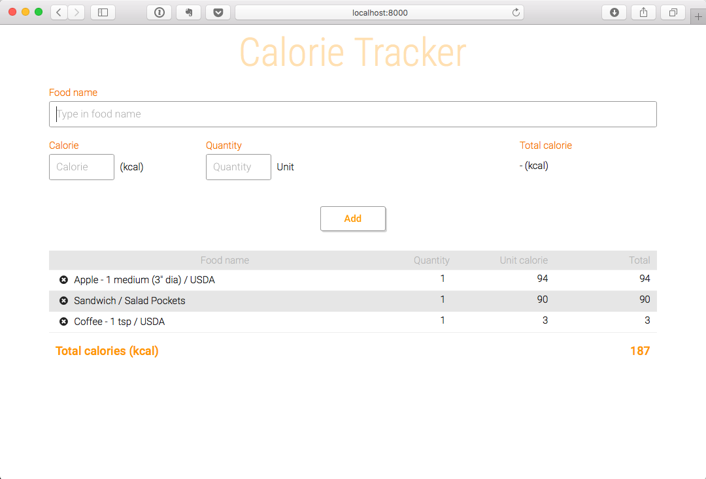
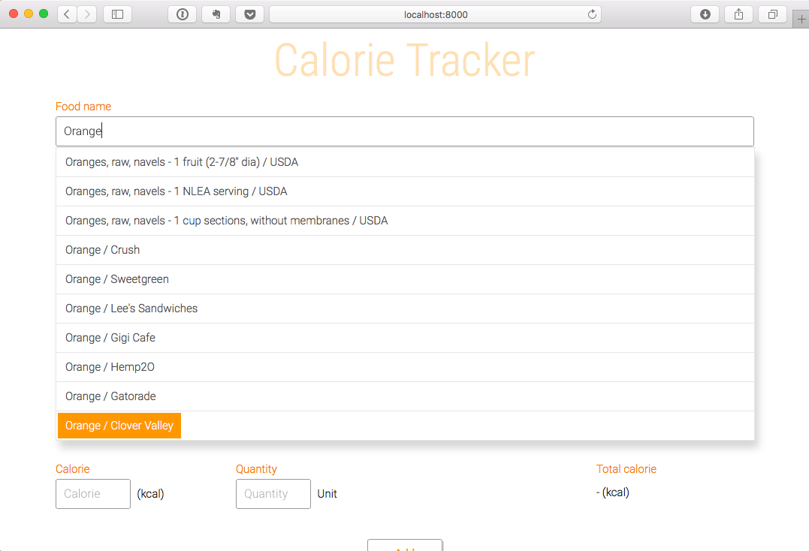

# Calorie tracker

This application keeps track of the calories of the food of your choice. You can select food from the list displayed when you enter a keyword in the search box or you can type in all the information youself. The food information is retrieved from the [Nutritionix](https://www.nutritionix.com/) database.

Start with typing in a foodname in the "Food name" field. A dropdown list is shown for you to select the matched food items from the database. Selecting one of the suggested food items will fill in the other fields, such as Calorie and Quantity. Update the values if necessary. It will automatically recalculate the total calorie value.

Once you are happy with the information, click on "Add" button, then it will add the food item to your list. Repeat the same process to add more food items to the list.

The applicatin uses a [Firebase](www.firebase.com) database, which is shared by all applicaiton instances. Using firebase to store the food list doesn't make sense for this application particularly when multiple people concurrently access this app, unless the list is stored separately for each session, but this is used just to show that I can use Firebase APIs.

## Run instructions

This application can be run locally in a browser or in localhost hosted in a local HTTP server. Internet connection is required to retrive the food information from the Nutoritionix database.

## Screenshot

